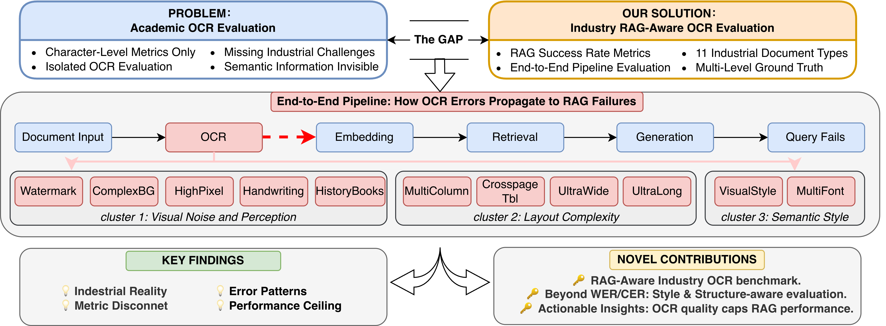

<h1 align="center">InduOCRBench</h1>

<div align="center">
English | <a href="./README_zh-CN.md">简体中文</a>
</div>

[\[📜 arXiv\]](https://arxiv.org/abs/2605.00911) | [[Dataset (🤗Hugging Face)]](https://huggingface.co/datasets/qihoo360/InduOCRBench)

---
## News

- **[2026-04]** InduOCRBench paper accepted to ACL 2026 Industry Track. Dataset released.

---




---

## 📖 Introduction

**InduOCRBench** is an OCR benchmark for industrial RAG systems, covering 11 challenging document types observed in real-world enterprise workflows. It addresses the gap between traditional character-level OCR metrics and actual downstream RAG utility, evaluating OCR robustness in terms of both transcription fidelity and end-to-end retrieval performance.

**Key Features:**
- **Real-world scenarios**: Data sampled from 10,000 documents spanning 12 industries.
- **Scale and diversity**: Contains **570** PDF documents and **3,402** pages covering **11** challenge types + 1 Normal category.
- **High-quality annotations**: Fine-grained Hybrid Markdown annotations (Markdown + HTML tables + LaTeX formulas + style tags), with a 3-stage human-in-the-loop quality control achieving 98% accuracy.
- **Dual evaluation tracks**: OCR fidelity (character/structure metrics) and RAG impact (end-to-end retrieval + generation accuracy).

**Key findings:**
- Models achieving near-perfect scores on standard benchmarks (OmniDocBench) decline sharply on InduOCRBench (e.g., PP-StructureV3 drops 26.4 points, PaddleOCR-VL drops 14.7 points).
- High OCR accuracy does **not** necessarily translate into strong downstream RAG performance. `VisualStyle` documents achieve 82.9% OCR accuracy yet only 52.8% RAG accuracy — a 30.1-point discrepancy.
- OCR-induced information loss is a strong and stable upstream limiting factor across all OCR-first RAG architectures.

**The benchmark releases two evaluation tracks:**
1. **OCR Fidelity Evaluation** — character/structure-level metrics comparing OCR output to ground-truth Markdown (`ocr_data/`).
2. **RAG Impact Evaluation** — end-to-end pipeline evaluation measuring how OCR quality affects retrieval and answer accuracy (`RAG_eval/`).

---

## 📊 Dataset Statistics

| Statistic | Value |
|---|---|
| Total documents | 570 |
| Total pages | 3,402 |
| Industries covered | 11 challenge types + 1 Normal |
| QA pairs (RAG eval) | 2071 |
| Annotation format | Hybrid Markdown (Markdown + HTML tables + LaTeX formulas + style) |

11 challenge document types including:
- ComplexBackground
- HighPixel
- UltraLong
- MultiColumn
- UltraWide
- HistoryBooks
- Handwriting
- MultiFont
- VisualStyle
- Watermark
- CrosspageTable

---

## 📂 Dataset Structure

The dataset is stored in the `ocr_data` directory, containing original files and annotations in two formats:

```text
InduOCRBench/
├── ocr_data/
│   ├── pdf.zip           # Original PDF documents (570 files, 3402 pages)
│   ├── md.zip            # [Recommended] Ground-truth Markdown for OCR evaluation
│   └── md_original.zip   # Full-fidelity annotations preserving all visual style tags
│
├── RAG_eval/
│   ├── QA_pairs.jsonl    # QA pairs for RAG pipeline evaluation
│   └── doc_md/           # Ground-truth Markdown files referenced by QA_pairs.jsonl
│
├── README.md
└── README_zh-CN.md
```

- **md_original**: Full-fidelity Markdown annotations preserving all visual style tags (e.g., font, color, alignment, layout). Suitable for studies requiring high-fidelity document reconstruction.

- **md**: Style-stripped Markdown annotations containing only textual content. This version serves as the standard Ground Truth for OCR evaluation to ensure fair comparison.

- **doc_md**: Hybrid Markdown annotations for RAG construction. Style information is preserved for VisualStyle documents while removed for other document types. This version is designated as the standard Ground Truth for RAG indexing and QA evaluation.

## 🚀 OCR Evaluation

This benchmark uses the `md2md` method from **OmniDocBench** for evaluation. For details, see: https://github.com/opendatalab/OmniDocBench/tree/main

### Evaluation Result

<div align="center">
Table 1. OCR fidelity evaluation on InduOCRBench using md2md metrics
</div>

<table style="width:100%; border-collapse: collapse;">
    <thead>
        <tr>
            <th>Model Type</th>
            <th>Methods</th>
            <th>Size</th>
            <th>Overall&#x2191;</th>
            <th>Text<sup>EDS</sup>&#x2191;</th>
            <th>Formula<sup>CDM</sup>&#x2191;</th>
            <th>Table<sup>TEDS</sup>&#x2191;</th>
            <th>Table<sup>TEDS-S</sup>&#x2191;</th>
            <th>Read Order<sup>EDS</sup>&#x2191;</th>
        </tr>
    </thead>
    <tbody>
        <tr>
            <td rowspan="9"><strong>Specialized</strong><br><strong>VLMs</strong></td>
            <td>PaddleOCR-VL-1.5</td>
            <td>0.9B</td>
            <td><strong>79.01</strong></td>
            <td><strong>88.33</strong></td>
            <td>75.3</td>
            <td><strong>73.41</strong></td>
            <td><strong>77.27</strong></td>
            <td>85.3</td>
        </tr>
        <tr>
            <td>PaddleOCR-VL</td>
            <td>0.9B</td>
            <td><ins>78.24</ins></td>
            <td><ins>88.1</ins></td>
            <td>74.6</td>
            <td><ins>72.03</ins></td>
            <td>75.87</td>
            <td>85.6</td>
        </tr>
        <tr>
            <td>Logics-Parsing-v2</td>
            <td>4B</td>
            <td>75.71</td>
            <td>84.94</td>
            <td>72.3</td>
            <td>69.90</td>
            <td>76.17</td>
            <td><strong>88.9</strong></td>
        </tr>
        <tr>
            <td>MinerU2.5-Pro</td>
            <td>1.2B</td>
            <td>74.47</td>
            <td>81.63</td>
            <td><ins>75.8</ins></td>
            <td>65.99</td>
            <td>70.46</td>
            <td>79.1</td>
        </tr>
        <tr>
            <td>FireRed-OCR</td>
            <td>2B</td>
            <td>74.09</td>
            <td>87.9</td>
            <td>72.4</td>
            <td>61.98</td>
            <td>66.45</td>
            <td><ins>85.8</ins></td>
        </tr>
        <tr>
            <td>MinerU2.5</td>
            <td>1.2B</td>
            <td>72.50</td>
            <td>81.8</td>
            <td>75.4</td>
            <td>60.31</td>
            <td>63.10</td>
            <td>84.4</td>
        </tr>
        <tr>
            <td>GLM-OCR</td>
            <td>0.9B</td>
            <td>68.64</td>
            <td>63.18</td>
            <td>72.1</td>
            <td>70.64</td>
            <td><ins>76.72</ins></td>
            <td>77.2</td>
        </tr>
        <tr>
            <td>hunyuan-ocr</td>
            <td>0.9B</td>
            <td>68.08</td>
            <td>86.1</td>
            <td>65.6</td>
            <td>52.53</td>
            <td>58.34</td>
            <td>85.7</td>
        </tr>
        <tr>
            <td>deepseek-ocr</td>
            <td>1.2B</td>
            <td>61.46</td>
            <td>75.5</td>
            <td>61.8</td>
            <td>47.07</td>
            <td>49.31</td>
            <td>81.8</td>
        </tr>
        <tr>
            <td rowspan="4"><strong>General</strong><br><strong>VLMs</strong></td>
            <td>Gemini-2.5 Pro</td>
            <td>-</td>
            <td>74.53</td>
            <td>83.1</td>
            <td><strong>77.2</strong></td>
            <td>63.29</td>
            <td>67.28</td>
            <td>81.1</td>
        </tr>
        <tr>
            <td>Qwen3-VL-235B</td>
            <td>235B</td>
            <td>70.91</td>
            <td>83.3</td>
            <td>74.8</td>
            <td>54.63</td>
            <td>59.43</td>
            <td>82.1</td>
        </tr>
        <tr>
            <td>Ovis2.6-30B-A3B</td>
            <td>30B</td>
            <td>59.34</td>
            <td>60.2</td>
            <td>65.8</td>
            <td>52.03</td>
            <td>57.00</td>
            <td>64.4</td>
        </tr>
        <tr>
            <td>GPT-4o</td>
            <td>-</td>
            <td>52.01</td>
            <td>60.8</td>
            <td>58.1</td>
            <td>37.15</td>
            <td>43.83</td>
            <td>70.0</td>
        </tr>
        <tr>
            <td rowspan="2"><strong>Pipeline</strong><br><strong>Tools</strong></td>
            <td>Mineru2-pipeline</td>
            <td>-</td>
            <td>66.54</td>
            <td>80.1</td>
            <td>63.2</td>
            <td>56.32</td>
            <td>62.05</td>
            <td>81.3</td>
        </tr>
        <tr>
            <td>PP-StructureV3</td>
            <td>-</td>
            <td>60.32</td>
            <td>78.2</td>
            <td>53.7</td>
            <td>49.07</td>
            <td>62.06</td>
            <td>79.1</td>
        </tr>
    </tbody>
</table>


### Evaluation Setup
To ensure maximum fairness, please follow these settings:
1. **Ground Truth**: Please use the Markdown files extracted from `ocr_data/md.zip` as the benchmark.
2. **Metric**: Use the `md2md` evaluation metric to calculate similarity scores.

> Note: Although `md_original` is provided, for standard leaderboard evaluations, please uniformly use the data under the `md` directory to align with the evaluation standards.


## 📝 Usage

1. Download and extract the data:
   ```bash
   cd ocr_data
   unzip pdf.zip
   unzip md.zip
   ```

2. Run your model to perform inference on the documents in the `pdf` directory, generating prediction results in Markdown format.

3. Use the evaluation script to compare your prediction results with the Ground Truth under the `md` directory.

## RAG Impact Evaluation

The RAG evaluation track measures how OCR quality affects end-to-end retrieval-augmented generation performance, going beyond character-level metrics to capture structural and semantic preservation.

### RAG Evaluation Data

The `RAG_eval/` directory contains:

- **`QA_pairs.jsonl`**: 2,071 QA pairs covering all 11 document challenge types.
- **`doc_md/`**: Ground-truth Markdown files for RAG indexing, using the `doc_md` format (style information preserved for VisualStyle document types, removed for others).

Each QA entry has the following fields:

```json
{
  "doc_type": "cross_page_table",
  "filename": "cross_page_table_1.md",
  "title": "Document title",
  "file_path": "RAG_eval/doc_md/cross_page_table_1.md",
  "question_category": "...",
  "question": "...",
  "answer": "...",
  "evidence": "..."
}
```

### RAG Pipeline Setup

We adopt the [FlashRAG](https://github.com/RUC-NLPIR/FlashRAG) Naive pipeline with the following configuration:

| Component | Setting |
|---|---|
| Embedding | BGE-M3 |
| Retrieval | Dense, Flat index, top-100 |
| Reranking | BGE-Rerank-V2-M3, top-10 |
| Generation | ChatGPT-5 |
| Chunking | HTML tree structure, max 256 tokens |
| Evaluation | RAGAS framework (GPT-OSS-120B as judge) |

### RAG Evaluation Metrics

- **Context Recall**: Measures whether retrieved passages contain evidence supporting the ground-truth answer.
- **Answer Accuracy**: Evaluates the correctness of the generated answer relative to the ground truth.

### Key RAG Findings

| Document Type | OCR Accuracy | RAG Accuracy | Gap |
|---|---|---|---|
| VisualStyle | 82.9% | 52.8% | -30.1 pts (blind spot) |
| CrosspageTbl | 40.7% | 63.8% | +23.1 pts (LLM compensates) |
| UltraWide | 28.1% | 49.1% | low-low (structural failure) |
| MultiFont | 97.2% | 97.5% | ≈0 (aligned) |

**High OCR accuracy does not guarantee strong RAG performance.** VisualStyle documents demonstrate the largest OCR–RAG discrepancy: despite 82.9% character-level accuracy, only 52.8% RAG accuracy is achieved because OCR strips visual formatting cues (strikethroughs, color emphasis) that encode critical semantics.

## 📄 License

This project is released under an open-source license. Please comply with relevant laws and regulations when using this dataset. The data is for research and academic purposes only.

## Acknowledgement

- Thank [OmniDocBench](https://github.com/opendatalab/OmniDocBench) for OCR metric calculation.
- Thank [FlashRAG](https://github.com/RUC-NLPIR/FlashRAG) for the RAG pipeline framework.
- Thank [ragas](https://github.com/vibrantlabsai/ragas) for the RAG metrics evaluation.


## 🖊️ Citation

If you use InduOCRBench in your research, please consider citing:

```bibtex
@misc{induocrbench,
  title={When Good OCR Is Not Enough: Benchmarking OCR Robustness for Retrieval-Augmented Generation},
  author={Lin Sun and Wangdexian and Jingang Huang and Linglin Zhang and Change Jia and Zhengwei Cheng and Xiangzheng Zhang},
  year={2026},
  eprint={2605.00911},
  archivePrefix={arXiv},
  primaryClass={cs.CV},
  url={https://github.com/Qihoo360/InduOCRBench},
}
```